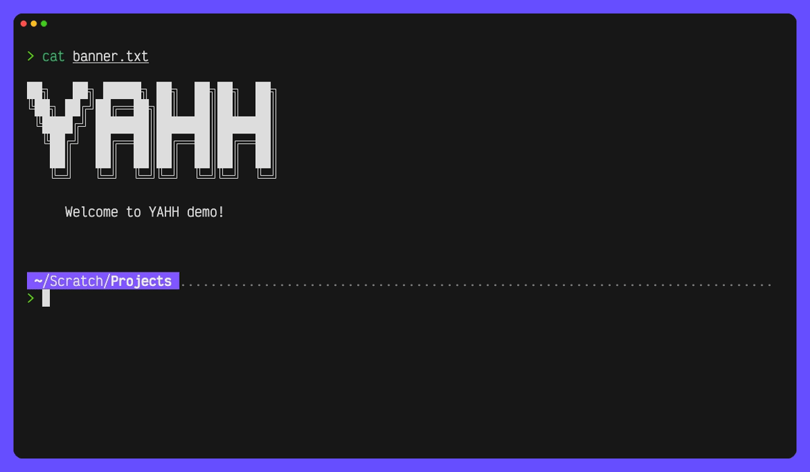

██╗   ██╗ █████╗ ██╗  ██╗██╗  ██╗
╚██╗ ██╔╝██╔══██╗██║  ██║██║  ██║
 ╚████╔╝ ███████║███████║███████║
  ╚██╔╝  ██╔══██║██╔══██║██╔══██║
   ██║   ██║  ██║██║  ██║██║  ██║
   ╚═╝   ╚═╝  ╚═╝╚═╝  ╚═╝╚═╝  ╚═╝

# YAHH (Yet Another History Hack)

YAHH is a Zsh-based tool that helps you manage separate command histories on a per-project basis. Instead of having one global history file or one per directory, YAHH allows you to keep distinct histories—called **realms**—for each of your projects.

This makes it easier to recall recurrent commands that are specific to a given project but not necessarily all in the same directory.



---

## Motivation

Often, we use the same commands repeatedly within a project (e.g., build, test, deploy commands) and it can be very useful to have these commands separated from the rest of our global history. I created YAHH to address this need, allowing you to isolate your project-specific commands so that your workflow remains cleaner and more focused.

---

## Concept of Realms

A **realm** is a project-specific command history. Here's how it works:

- **Pointer File:**  
  In any directory where you want to activate a realm, you create a hidden `.history` file. This file contains a pointer (i.e., a file path) to a central history file. It's done by calling "yahh create".

- **Central History File:**  
  The actual command history is stored centrally (typically under `$HOME/.config/yahh`). When you enter a directory (or any of its subdirectories) that contains a `.history` pointer file, YAHH automatically switches your active history to the associated central history file.

- **Seamless Switching:**  
  As you navigate between directories, YAHH detects the presence (or absence) of a `.history` file and switches to the appropriate history realm. If no realm is found, your default global history is used.

- **Lifecycle Commands:**  
  You can create new realms, remove them (while preserving a backup of the old history), list available realms, and prune (delete) removed realms.

  The whole yahh functionality can be disable at any given time. For example, if you want to recall a command in your global history without leaving a directory under a history realm, and your default history content will be loaded automatically.

---

## Installation

### Prerequisites

- **Zsh:** YAHH is designed to work with the Z shell.
- **Git:** (Optional) For cloning the repository.

### Steps

1. **Clone the Repository:**

   ```bash
   git clone https://github.com/Positronico/yahh.git
   cd yahh
   ```

2. **Install YAHH:**

   Add the following line to your `~/.zshrc` file to source YAHH automatically:

   ```zsh
   source /path/to/yahh.sh
   ```

   Replace `/path/to/yahh.sh` with the actual path to the script.

3. **Reload Your Shell:**

   Restart your terminal or run:

   ```bash
   source ~/.zshrc
   ```

---

## Usage

YAHH provides several commands to manage your history realms. Use the `yahh` command followed by one of the subcommands:

- **`yahh create`**  
  Creates a new empty history realm in the current directory by:
  - Generating a `.history` pointer file in the directory.
  - Creating a new, empty central history file in your YAHH configuration directory.
  - Switching your shell to use the new realm.

- **`yahh remove`**  
  Removes the history realm from the current directory by:
  - Deleting the `.history` pointer file.
  - Renaming the associated central history file (so you can review its contents later, if needed).

- **`yahh which`**  
  Outputs the path of the active `.history` pointer file defining the current realm (if any).

- **`yahh list`**  
  Lists all active and removed history realms stored in your YAHH configuration directory.

- **`yahh prune`**  
  Permanently deletes all removed (inactive) central history files after a single confirmation prompt.

- **`yahh status`**  
  Displays the current YAHH status, including:
  - Whether YAHH is enabled.
  - The current working directory.
  - The active realm (if any) and its corresponding central history file.
  - The current active history file (`HISTFILE`).

- **`yahh disable`**  
  Disables YAHH, causing your shell to revert to using the default global history file. This also disables the recursive lookup for a `.history` pointer file.

- **`yahh enable`**  
  Enables YAHH, allowing it to automatically switch realms as you change directories.

### When to Use YAHH

- **Project-Based History:**  
  Use YAHH if you want to keep the command history for each project separate, so that you can easily recall and reuse project-specific commands without interference from your global history.

- **Streamlined Workflow:**  
  By isolating command histories per realm, you reduce clutter and enhance your productivity when working on multiple projects.

---

## Screenshots

TODO: *(Add screenshots or GIFs here to visually demonstrate YAHH in action.)*

---

## FAQ

**Q: What happens to my existing history when I create a new realm?**  
A: When you create a new realm, YAHH forces a clear of the in-memory history and starts with an empty history file for that realm. Commands executed prior to realm creation remain in your previous history file.

**Q: Can I switch back to my default history after using a realm?**  
A: Yes, using `yahh disable` will revert to your default global history file.

**Q: How does YAHH affect performance?**  
A: YAHH recursively searches for a .history file starting from the current directory and moving upward. In my tests on a Mac Studio M1 Pro 1TB, it performs up to 10,000 checks per second—resulting in a negligible delay (likely even faster than many of the plugins or fancy prompts you may already use). When YAHH is disabled, the recursive check is skipped entirely to optimize performance. You can enable or disable YAHH at any time as needed.

**Q: Are there any limitations with using multiple realms?**  
A: Realms are designed to be straightforward. However, if you frequently switch between many realms, it’s important to keep your configuration directory well organized. The system can flag a history file from a removed realm, but it doesn’t automatically manage or clean up history files from projects you no longer need. Therefore, it’s recommended that you regularly remove and prune outdated realms.

---

## Changelog

- **v1.0.0** - Initial release of YAHH.

---

## Contributing

Contributions are welcome! Whether it's bug fixes, improvements, or new features, your input is highly appreciated.

### How to Contribute

- **Report Issues:**  
  If you encounter any bugs or have suggestions for improvements, please open an issue on the repository.

- **Feature Requests:**  
  Have an idea for a new feature? Let us know by creating an issue with your suggestion.

- **Pull Requests:**  
  Fork the repository, implement your changes, and submit a pull request. Please adhere to the coding style and include tests for new features where possible.

---

## License

This project is licensed under the [MIT License](LICENSE).

---

*Happy hacking with YAHH!*
